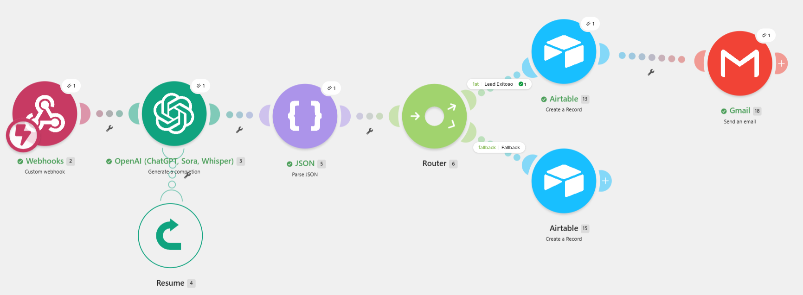
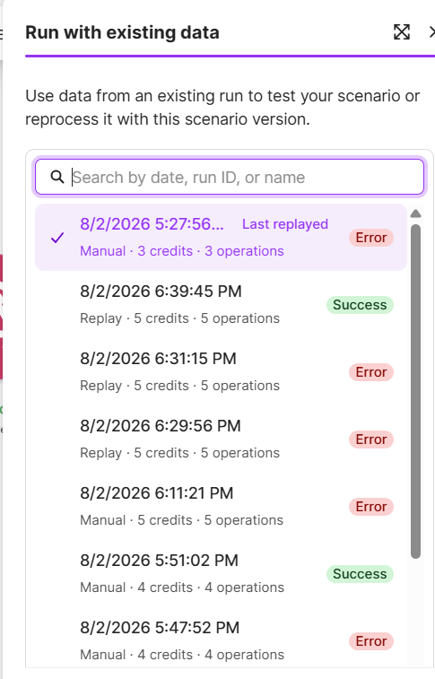

# Entrega Final: Construcción de tu Ecosistema de Automatización IA

## 1. Explicación del Caso de Uso
Sistema automatizado de triage, clasificación técnica, evaluación de fit comercial y generación de propuestas personalizadas para solicitudes de consultoría tecnológica.

## 2. Enlaces Obligatorios
* **Base de Datos Airtable (Modo Lectura):** https://airtable.com/appH0efkP9ky99sBs/shrM6QfeCC41gpbp5
* **Diagrama de Arquitectura:** Ver archivo `Diagrama_Arquitectura.pdf` adjunto en este repositorio.

## 3. Arquitectura y Resiliencia del Flujo
* **Cerebro (Base de Datos):** Airtable relacional con control de estados (`Pendiente`, `Procesado por IA`, `Aprobado para Envío`, `Error en Proceso`).
* **Trigger Inteligente:** Ingesta mediante Custom Webhook para optimizar el consumo de operaciones en Make.
* **Motor de IA:** OpenAI (`gpt-4o-mini`) restringido a 800 Max Tokens y salida en formato JSON estricto.
* **Gestión de Errores (Resiliencia):** Directiva `Resume` conectada al módulo de OpenAI para inyectar un payload JSON de emergencia en caso de fallo de API, derivando el registro a la ruta `Fallback` del Router para actualizar Airtable con `Estado = Error en Proceso` sin colapsar el escenario.
* **Human-in-the-Loop:** El flujo detiene su ejecución asignando el estado `Procesado por IA` en Airtable. Requiere la validación y aprobación manual de un operador humano (cambio de estado a `Aprobado para Envío`) antes de emitir la comunicación final al cliente.

## 4. Evidencias del Test de Estrés

